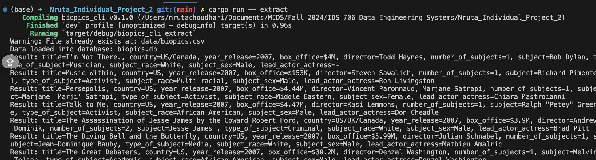
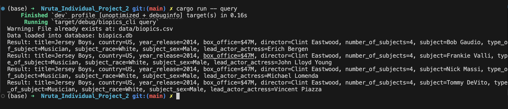

[](https://github.com/nogibjj/Nruta_Individual_Project_2/actions/workflows/rust_cicd.yml)
# IDS 706 Individual Project 2 - Rust CLI Binary with SQLite

### 🏗️ Requirements
The project should include the following:
- Rust source code: The code should comprehensively understand Rust's syntax and unique features.
- Use of Github Copilot (Use of other LLMs): In your README, explain how you utilized Github Copilot or other LLM models in your coding process. - SQLite Database: Include a SQLite database and demonstrate CRUD (Create, Read, Update, Delete) operations.
- Optimized Rust Binary: Include a process that generates an optimized Rust binary as a Gitlab Actions artifact that can be downloaded.
- README.md: A file that clearly explains what the project does, its dependencies, how to run the program, and how Gitlab Copilot was used.
- Github/Gitlab Actions: A workflow file that tests, builds, and lints your Rust code.
- Video Demo: A YouTube link in README.md showing a clear, concise walkthrough and demonstration of your CLI binary.

### 📂 Project Structure
```
.
├── .devcontainer
│   ├── Dockerfile
│   └── devcontainer.json
├── .github
│   └── workflows
│       └── rust_cicd.yml
├── .gitignore
├── Cargo.lock
├── Cargo.toml
├── Makefile
├── README.md
├── biopics.db
├── data
│   └── biopics.csv
├── query_log.md
├── src
│   ├── lib.rs
│   └── main.rs
└── tests
    └── test.rs
```

### 🛠️ Setup Instructions
1. Clone the repository:
```
git clone https://github.com/nogibjj/Nruta_Mini_Project_8
```

2. Navigate to the project directory:
```
cd Nruta_Individual_Project_2
```

3. Set up Rust dependencies:
Ensure you have Rust installed. You can download it from rust-lang.org.

4. Build the Rust project and install dependencies:
```
cargo build --release
```

5. Run the Project
For Rust, use the following command:
```
cargo run
```

### 💾  CRUD Operations and Output
The CRUD operations are as follows:
- `CREATE`: Insert new records into a table.
- `READ`: Query and retrieve records from the table.
- `UPDATE`: Modify existing records within the table.
- `DELETE`: Remove records from the table.

The dataset being used here is `biopics.csv` provided by FiveThirtyEight.

The outputs of these commands are provided in the screenshots below:




### 🤖 Usage of LLMS in the Coding Process
As a beginner to Rust, I relied on LLMs to understand the code structure and to help me understand in how the syntax differs from Python. A few weeks earlier, I had completed a similar project in Python, which served as a foundational reference for my work in Rust. The LLMs played a crucial role in clarifying Rust’s syntax, providing code examples, and assisting me with debugging, which significantly accelerated my learning curve and enhanced my understanding of the language. This support allowed me to break down what initially seemed like an intimidating task into manageable chunks, helping me understand the process more effectively and enhancing my overall learning experience.

### 🎥 Demo Video
Please click [here](https://youtu.be/piLs553IF9A) where I walk through the project.
